# Diagrama de Clases UML - CS-GradeCalculator

```mermaid
classDiagram
    %% Value Objects
    class Grade {
        -value: number
        +create(value: number) Grade
        +getValue() number
        +getRoundedValue() number
        +equals(other: Grade) boolean
    }

    class WeightPercentage {
        -value: number
        +create(value: number) WeightPercentage
        +getValue() number
        +toDecimalFactor() number
        +equals(other: WeightPercentage) boolean
    }

    class StudentId {
        -value: string
        +create(value: string) StudentId
        +getValue() string
        +equals(other: StudentId) boolean
    }

    %% Entities
    class Evaluation {
        -grade: Grade
        -weightPercentage: WeightPercentage
        +create(grade: number, weight: number) Evaluation
        +getGrade() Grade
        +getWeightPercentage() WeightPercentage
        +calculateWeightedContribution() number
    }

    class Student {
        -studentId: StudentId
        -evaluations: Evaluation[]
        -attendancePolicy: AttendancePolicy
        -extraPointsPolicy: ExtraPointsPolicy
        +create(id: string, attendance: boolean, extraPoints: boolean) Student
        +addEvaluation(grade: number, weight: number) void
        +updateAttendancePolicy(hasMinimum: boolean) void
        +updateExtraPointsPolicy(allowed: boolean) void
        +calculateFinalGrade() number
        +getCalculationDetail() CalculationDetail
    }

    %% Policies
    class AttendancePolicy {
        -hasReachedMinimumClasses: boolean
        +create(hasMinimum: boolean) AttendancePolicy
        +meetsMinimumRequirement() boolean
    }

    class ExtraPointsPolicy {
        -allYearsTeachers: boolean
        +create(allowed: boolean) ExtraPointsPolicy
        +allowsExtraPoints() boolean
    }

    %% Use Cases
    class RegisterEvaluationUseCase {
        -studentRepository: StudentRepository
        +execute(request: RegisterEvaluationRequest) Promise~RegisterEvaluationResponse~
    }

    class CalculateFinalGradeUseCase {
        -studentRepository: StudentRepository
        +execute(request: CalculateFinalGradeRequest) Promise~CalculateFinalGradeResponse~
    }

    %% Repository Interface
    class StudentRepository {
        <<interface>>
        +findById(studentId: string) Promise~Student~
        +save(student: Student) Promise~void~
        +delete(studentId: string) Promise~void~
        +findAll() Promise~Student[]~
    }

    class InMemoryStudentRepository {
        -students: Map~string, Student~
        +findById(studentId: string) Promise~Student~
        +save(student: Student) Promise~void~
        +delete(studentId: string) Promise~void~
        +findAll() Promise~Student[]~
    }

    %% Facade
    class GradeCalculator {
        -registerEvaluationUseCase: RegisterEvaluationUseCase
        -calculateFinalGradeUseCase: CalculateFinalGradeUseCase
        +registerEvaluation(id: string, grade: number, weight: number) Promise~void~
        +calculateFinalGrade(id: string) Promise~number~
        +getCalculationDetail(id: string) Promise~CalculationDetail~
    }

    %% Relationships
    Evaluation "1" *-- "1" Grade : contains
    Evaluation "1" *-- "1" WeightPercentage : contains
    Student "1" *-- "1" StudentId : has
    Student "1" *-- "*" Evaluation : contains
    Student "1" *-- "1" AttendancePolicy : has
    Student "1" *-- "1" ExtraPointsPolicy : has
    
    RegisterEvaluationUseCase ..> StudentRepository : uses
    CalculateFinalGradeUseCase ..> StudentRepository : uses
    InMemoryStudentRepository ..|> StudentRepository : implements
    
    GradeCalculator --> RegisterEvaluationUseCase : uses
    GradeCalculator --> CalculateFinalGradeUseCase : uses
```

## Descripción de Componentes

### Value Objects (Objetos de Valor)
- **Grade**: Representa una nota en el rango [0-20]
- **WeightPercentage**: Representa un porcentaje de peso [0-100]
- **StudentId**: Identificador único del estudiante

### Entities (Entidades)
- **Evaluation**: Representa una evaluación con su nota y peso
- **Student**: Agregado raíz que contiene todas las evaluaciones y políticas

### Policies (Políticas)
- **AttendancePolicy**: Política de asistencia mínima requerida
- **ExtraPointsPolicy**: Política de puntos extra acordada por docentes

### Use Cases (Casos de Uso)
- **RegisterEvaluationUseCase**: RF01 - Registrar evaluaciones
- **CalculateFinalGradeUseCase**: RF04 - Calcular nota final

### Repository (Repositorio)
- **StudentRepository**: Interfaz para persistencia
- **InMemoryStudentRepository**: Implementación en memoria

### Facade (Fachada)
- **GradeCalculator**: Punto de entrada principal del sistema
